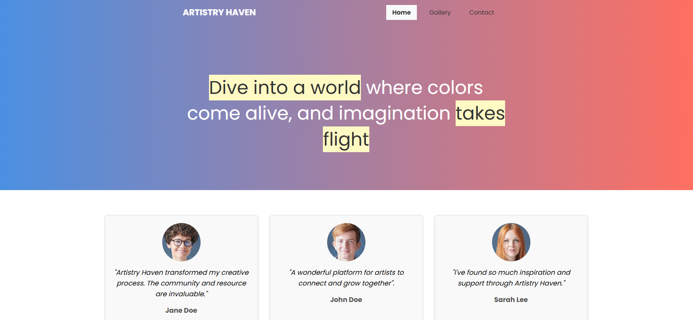

# Artistry Have

Artistry Haven is a vibrant and Visually appealing website designed to connect artists and art enthusiasts. It serves as a platform to showcase creativity, share inspiration and foster a community of like-minded individuals.

## Features

### 1. Homepage

- A hero section with a welcoming message
- Testimonials from users sharing their experiences
- Services section highlighting the platform offerings
- A gallery showcasing a collection of artwork.
- A team section introducing the people behind Artistry Haven.

### 2. Gallery

- A visually rich gallery section with lightbox functionality for viewing images in detail.

### 3. Contact Page

- A contact form for uses to get in touch with the Artistry Haven Team.
- Contact details and social media links for communication

### 4. Responsive Design

- Fully responsive layout optimized for various screen sizes, ensuring a seamless experience on both desktop and mobile devices.

## Technologies Used

- HTML5: For structuring the content
- CSS3: For styling and layout, including responsive design
- Javascript: For interactivity, such as navigation background changes on scroll.
- Font Awesome: For icons used throughout the site.
- Lighbox2: For the gallery's image viewing functionality.
